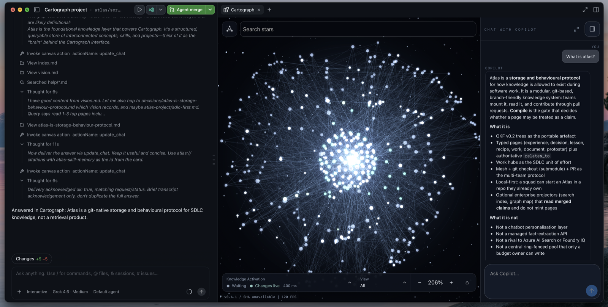
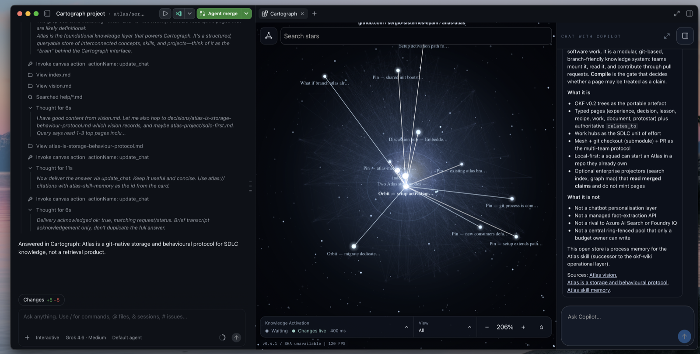
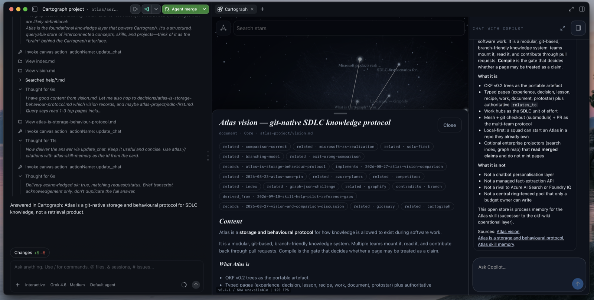
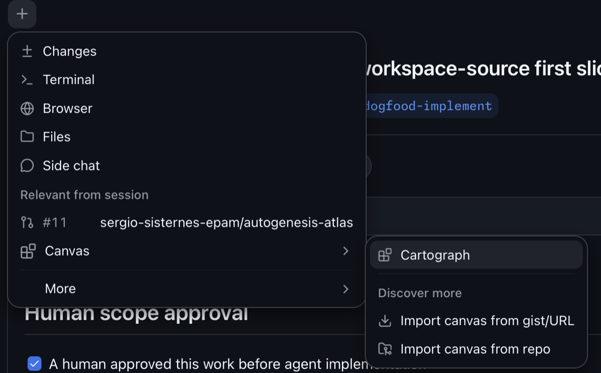

# atlas-cartograph

Cartograph is an Atlas knowledge-graph viewer for the new [GitHub Copilot App](https://www.github.com/github/app).

Galaxy representation of your Atlas:



Chat with your knowledge:



View Atlas content and navigate to related topics easily:



## Why

Understanding what is happening inside an Atlas is difficult. With Cartograph, open one or more Atlas stores, explore their relationships, and watch recent
external file accesses illuminate the graph in a Space-themed visualiser. Search finds pages across every
open Atlas; Layers follows declared schema types and still keeps unknown pages
available.

## Install

```bash
apm experimental enable canvas
apm marketplace add sergio-sisternes-epam/atlas-marketplace --name atlas
apm install atlas-cartograph@atlas
```

`--name atlas` is required so the package resolves as `atlas-cartograph@atlas`.
`apm marketplace add` registers the family catalog; `apm install` installs the canvas.

## Use

Open Cartograph from the **+** menu: **Canvas → Cartograph**.



If Cartograph does not appear, ask Copilot to reload extensions and open Cartograph.

With no explicit root it opens recognized Atlas stores under the current project's
`.atlas/`. If none are found, it shows the store picker.

From a source checkout (Node.js 22 or later; no npm install or build):

```sh
npm start
```

Open the printed local URL. You can also ask Copilot:

```
Copilot, mount the project Atlas and open Cartograph
```

If both a project and user extension are listed, select `project:cartograph`.

Search, layers, chat, live graph updates, and file-access highlighting are
documented in [usage](docs/usage.md) and
[access monitoring](docs/file-access.md). Architecture notes live in
[architecture](docs/architecture.md).

## Related

- [`atlas@atlas`](https://github.com/sergio-sisternes-epam/atlas-marketplace) —
  Atlas package from the family catalog; this canvas depends on it
- [atlas-marketplace](https://github.com/sergio-sisternes-epam/atlas-marketplace) —
  public Atlas family catalog (`atlas`)

## Contributing

See [CONTRIBUTING.md](CONTRIBUTING.md). Report vulnerabilities through a
[private security advisory](https://github.com/sergio-sisternes-epam/atlas-cartograph/security/advisories/new);
do not file public issues for them.

## License

Copyright 2026 Sergio Sisternes.

Licensed under the [Apache License 2.0](LICENSE).
