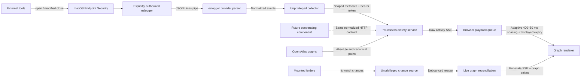

# Architecture

All executable implementation lives under `src/`. Documentation here is
hand-authored; there is no generated marketplace site or documentation generator.

| Component | Responsibility |
| --- | --- |
| `extension.mjs` | Copilot canvas lifecycle, actions, session working directory |
| `server.mjs` | Per-canvas loopback HTTP server, Atlas state, full-state SSE |
| `atlas/` | Store discovery, Markdown parsing, node linking and multi-Atlas merge |
| `atlas/watch.mjs` | Replaceable, unprivileged open-root filesystem change source |
| `atlas/live.mjs` | Debounced rescans, watcher status and explicit creation/deletion deltas |
| `public/` | Browser UI, graph layout, WebGL and Canvas 2D renderers |
| `public/activity-playback.js` | Adaptive visual queue, aggregation, display lifetimes, and pulse scheduling |
| `public/activity-camera.js` | Displayed-effect target selection, padded camera fit, manual override and idle restoration |
| `activity/model.mjs` | Exact file-to-node mapping, timers, temporal relationships |
| `activity/service.mjs` | Authenticated ingestion, settings, collector status, activity SSE |
| `activity/protocol.mjs` | Normalized access-event contract and common input limits |
| `activity/process-scope.mjs` | Process-scope validation and descendant/exclusion checks |
| `activity/providers/index.mjs` | Provider contract, registry, and explicit default selection |
| `activity/providers/eslogger.mjs` | macOS event parser, permissions, availability, setup and command |
| `activity/collector.mjs` | Provider-independent line-stream transport, scoping, batching and lifecycle |
| `dev.mjs` | Standalone development server using the same implementation |
| `fixtures/mini-atlas/` | Small local demonstration store |

The receiver rejects invalid batches atomically and only accepts files present
in its current graph. Collector target refresh is an optimization and privacy
boundary, not the sole authorization check. The receiver ignores its own PID.
Copilot canvases additionally filter to the current CLI session's process tree,
excluding the viewer subtree. The provider supplies bounded process ancestry;
the shared receiver checks that scope independently of file-to-node mapping.
Background reads from unrelated host-app processes cannot activate the graph.

Activity updates have their own SSE event and do not resend/rebuild the graph.
Raw observation expiry runs server-side. The browser coalesces repeated
pending accesses by node and plays at most one activation per frame, at intervals
of 400–50 ms, rather than delaying filesystem operations or transport. Display expiry
starts at playback time; natural server expiry does not cancel queued events.
Path segments are recorded only from the immediately preceding displayed
activation to the new one, when both endpoints are active and have a visible
graph relationship. They are not reconstructed from the set or order of active
nodes. Each relationship retains its latest actual traversal; other segments
keep their original direction and start time through node revisits.
Segments end with either endpoint or their own configured lifetime, whichever
comes first. Disabling or removing graph nodes clears
their pending and displayed activity. Both renderer paths share this playback;
WebGL does not pace a supplied, already-computed activity frame again.

Depth-based target intervals are 400 ms for 1–5 pending nodes, 200 ms for 6–15,
100 ms for 16–40 and 50 ms for 41+. Oldest queue age lowers the target to at most
100 ms after two seconds and 50 ms after five seconds. Interval adjustment is
linear, taking 250 ms for the full acceleration range and two seconds for full
recovery. Queue age uses the first enqueue time, even when repeated observations
replace a pending node's latest metadata. One slot per visible file bounds
repeated traffic; unique-file backlog can still grow up to the visible graph size.
There is no catch-up loop that drains a hidden tab's backlog in one frame.

Each raw node exposes `sequence` (global accepted observation order), `count`
and `firstSequence` for its current active interval. Expiry, pause or removal
resets the interval; physical-file ID remapping preserves it. Playback uses
counter deltas so heartbeats and same-millisecond batches cannot lose or double
count observations. Path edges require provably consecutive sequence ranges:
interleaved aggregation, missing observations and filtered intermediates cannot
manufacture shortcuts. Older snapshots without sequence metadata remain usable,
but repeated pending observations break ambiguous paths.

Relationship pair indexes avoid scanning every graph edge per activation.
Transient per-node observation counts and actual displayed traversal counts
feed the shared playback status; the UI updates at most every 200 ms. Counts
are not persistent history or proof of lossless capture. Collector errors remain
separate from queue pressure, and capture loss is explicitly unknown.

The API and extension actions continue to expose raw observations and co-active
relationships, not playback state or the displayed path. The browser does not
render the raw relationship list directly. Refreshing browser assets does not
change the collector URL or token.
Activity is transient per canvas, never a persistent access log. Closing a
canvas disposes clients, timers, and its HTTP listener.

Knowledge Activation includes a default-on, browser-page-local camera option.
The Canvas host owns camera projection (the WebGL renderer consumes projected
coordinates, not a separate camera). `activationFocusNodes` collects displayed
read nodes, lifecycle births/deletion ghosts and both endpoints of changed
relationships. Surviving ghost endpoints resolve by physical file identity.
Visible layers and query matches constrain targets. It never consumes raw
pending reads or puts ghosts back in the graph.

`ActivityCamera` fits these projected positions at most every 200 ms, using
65% of viewport width and 60% of height for padding, clamped to 0.22-3x zoom.
At the same cadence, mean unit radial normals select a front-facing surface
angle in the globe's yaw/pitch convention. Resultant length below 0.3 means
opposing/dispersed targets: retain the existing angle rather than chase noise.
An angular deadband of 0.08 radians suppresses small changes; yaw follows the
shortest arc and pitch stays within the existing +/-1.2-radian orbit limit.
The pivot stays fixed. Manual orbit retains pan/zoom following but suppresses
automatic orientation until five seconds after release.

Pan, logarithmic zoom and angles use critically damped motion with smooth times
of 0.55, 0.65 and 0.8 seconds, retaining velocity across target changes. Speeds
are limited to 1200 pixels/second for pan and 1.5 units/second for log zoom and
angles. Wider bounds request zoom-out immediately; zoom-in needs more than 8%
extra room sustained for 600 ms. A one-second idle hold precedes restoration
of saved pan/zoom/orientation; manual orbit updates the restoration angle.
Manual zoom/reset/island navigation cancels stale restoration and pauses all
following for five seconds. Selected-node focus and reduced-motion preferences
suppress it. Turning the
checkbox off holds the current framing, without changing read monitoring.
The setting resets to on on page reload; no backend configuration or collector
reconnection is involved.

Filesystem changes are independent of the read provider. `createFilesystemWatcher`
implements `setRoots(absolutePaths)` / `close()` and emits `onChange(root)` plus
`onStatus({status, message})`. `startServer` accepts a replacement through
`graphWatch.watcherFactory`. The native implementation uses recursive `fs.watch`
for each open root and a filtered parent watch to recover root replacement.
It never identifies an accessing process or escalates privileges.

`createLiveAtlas` debounces notifications for 150 ms, with a one-second maximum
wait. Rescans use strict I/O handling: inaccessible or invalid input surfaces an
error without committing a partial graph as mass deletion. Successful scans
update only the graph and selected page, preserving query, layers, grouping
and camera state; optional frontend framing then follows visible lifecycle
effects without resetting the layout. Graph equality suppresses duplicate lifecycle notifications.
Collector targets reconcile through the existing activity service.

Full-state snapshots include `graphWatch` and `graphChanges`. The latter carries
a monotonic `revision`, `origin` (`filesystem` or `mount`), `occurredAt`,
`durationMs` (2000), `created` / `deleted` node arrays, and
`createdEdges` / `deletedEdges` relationship arrays. Deltas compare each
node's absolute Atlas file path, not mutable titles or qualified graph IDs.
Mount/detach changes clear lifecycle effects rather than pretending files were
created/deleted. Renderers deduplicate revisions and retain temporary deletion
ghosts outside their interactive node collections; these never become read-path
steps. Neither the watcher nor lifecycle effects depends on `activity.enabled`.
The 2000 ms lifecycle envelope controls whole-node opacity, labels and new
attached edges. Creation ramps from zero to full opacity; deletion ramps to
zero without scale/particle effects. The green overlay rises and falls smoothly
so finishing a birth does not abruptly remove a full-brightness highlight.
Reduced motion retains static markers instead of animated fades.
New edge deltas compare endpoint file identities, direction and relationship
kinds, so graph ID renumbering does not recreate existing links. The shared
lifecycle model fades new edges in and applies a green glow that rises and
falls over 2000 ms. Deleted edges leave the live graph immediately and render
as separate red ghosts fading out over the same duration. Ghosts snapshot the
previously visible edge and its endpoints; surviving endpoints follow current
positions by file identity, while deleted endpoints retain their old positions
and are reprojected with the camera. Recreation, unmounting and node or
relationship-layer filtering cancel ghosts. Neither renderer adds lifecycle
effects to the read path.

Monitor-specific code is isolated behind the
[provider contract](monitor-providers.md). A provider can adapt a line stream
or report normalized events directly. The activity model and renderers know
nothing about macOS, `sudo`, or the producer's event schema. Setup text comes
from the selected provider's public metadata, not hardcoded UI instructions.
Only `macos-eslogger` is shipped; it remains the default without fallback or
automatic switching. Multiple providers can be registered, with one selected
per canvas.

The `.github/extensions/cartograph/extension.mjs` discovery entry point imports
the source tree. It is not a second implementation or generated copy.
